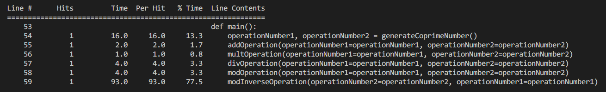
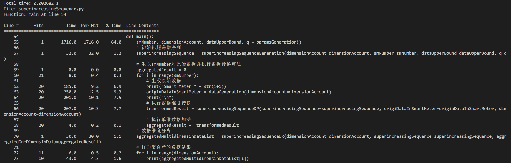
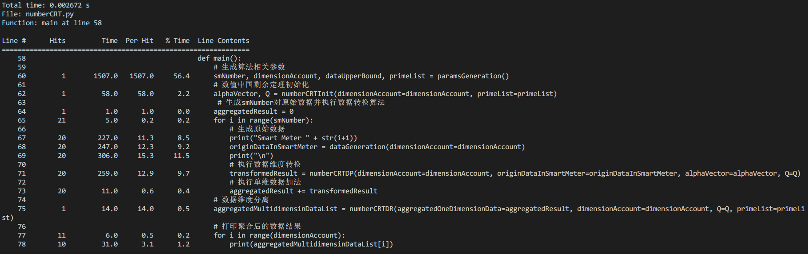
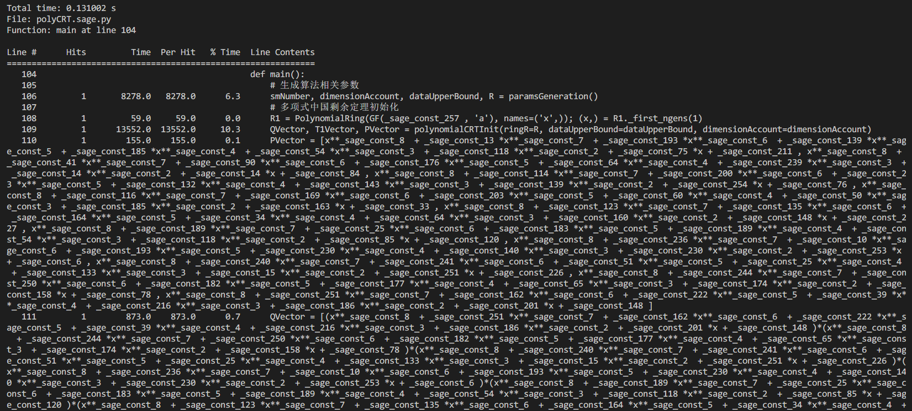
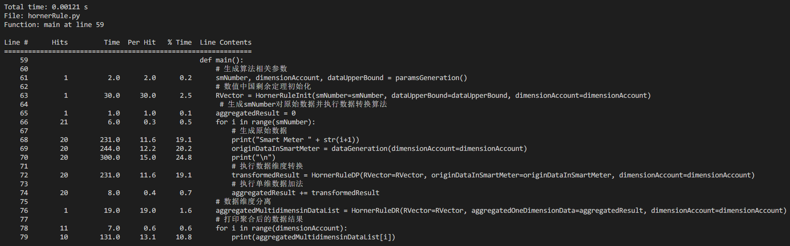
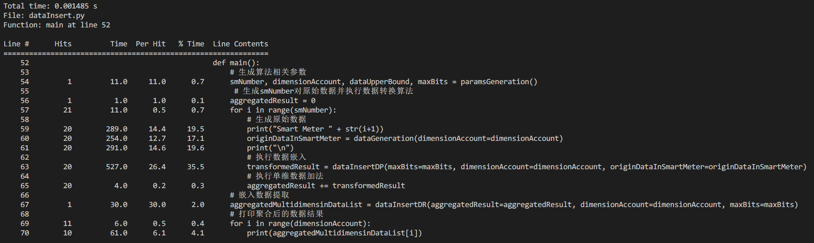

## Related Settings

### Simulation Configuration

Linux Ubuntu 18.04.1 Intel(R) Core(TM) i7-10700 CPU @ 2.90GHz and 4G memory

### Parameters Settings

| Parameters |                         Description                          | Settings |
| :--------: | :----------------------------------------------------------: | :------: |
|    $n$     | The number of the smart meters joining data aggregation process |    20    |
|    $D$     | Decimal representation of the upper bound constant for each dimension of data devices collected during aggregation process |   128    |
|    $z$     | Binary representation of the upper bound constant for each dimension of data devices collected during aggregation process, $z = log_2D$ |    7     |
|    $k$     |     Number of dimension of data collected by each device     |    10    |
|    $p$     | The degree of $k$ integrable polynomials introduced in the polynomial CRT for $k-$ dimensional data, $deg(d_{ij}(x)) < deg(p_j(x))$ |    9     |
|    $q$     | Range of coefficients of the polynomials $T(x)$ and $p(x)$ in the polynomial CRT |   257    |
|    $s$     | Number of bits of $k$ prime numbers ( $q_1,q_2,\dots,q_k$ ) in number CRT, satisfying $2^s \geq nD \Longrightarrow s \geq \lceil log_2n \rceil+z$ |    12    |

## Atomic Operation Computation Overhead

The objects for atomic operation are two mutually prime 100-bit numbers, and the atomic operation computation overhead evaluation results are as follows: 

|              Operation Name               | Operation Time ( $\mu s$ ) |
| :---------------------------------------: | :---------------------: |
|   Numerical Multiplication $T_{NMult}$    |           3.0           |
|       Numerical Division $T_{NDiv}$       |           4.0           |
|       Numerical Modular $T_{NMod}$        |           6.0           |
|   Numerical Modular Inverse $T_{NInv}$    |          93.0           |
| Numerical Addition/Subtraction $T_{NAdd}$ |           2.0           |

## Complexity Comparison

The complexity of the remaining operations such as polynomial operations and numerical decomposition could be evaluated by combing numerical atomic operations, the evaluation results are as follows:

* Polynomial addition and subtraction

  For the addition or subtraction among $l$ polynomials with the degree of $n$, the complexity is:
  
  $$
  T_{PAdd} = l \cdot n \cdot T_{NAdd}
  $$

* Polynomial multiplication and division

  For two polynomial objects with degree of $a$ and $b$, the multiplication and division complexity is as follows(suppose $a>b$): 

  * Polynomials multiplication: $T_{PMult} = (a+1)(b+1)\cdot T_{NMult} +\frac{1}{2}(a+b)(a+b+1) \cdot T_{NAdd}$
  * Polynomials division: $T_{PDiv} = (b+1)(a-b+1)\cdot(T_{NMult} + T_{NAdd})$

  As the modulo operation between two polynomials can be converted into a variant of the polynomial division operation(that's, **polynomial long division**), so the complexity of polynomials modulo is the same as polynomials division:
  
  $$
  T_{PMod} = T_{PDiv} = (b+1)(a-b+1) \cdot (T_{NMult} + T_{NAdd})
  $$

* Binary numerical decomposition and reduction

  For the decimal number with the maximum number of bits no more than $z$, the binary numerical decomposition and reduction operations can be evaluated by the combination of atomic operation:

  * Binary numerical decomposition algorithm $BD(\cdot)$: $T_{NBD} = (z-1) \cdot T_{NMult}$
  * Binary numerical reduction algorithm $BDI(\cdot):T_{NBDI} = z \cdot T_{NMult}+(z-1)\cdot T_{NAdd}$

The evaluation results of computation complexity of different dimension transformation algorithms are as follows:

| Dimension Transform Method |    Stage    |                    Computation Complexity                    |                   Storage Complexity(bits)                   |
| :------------------------: | :---------: | :----------------------------------------------------------: | :----------------------------------------------------------: |
| Super-increasing Sequence  |  $SS.Init$  |        $2\cdot (k-1)\cdot T_{NMult}+k\cdot T_{NAdd}$         | $\mathbf{\frac{k(k-1)}{2} \cdot \lceil log_2n+z \rceil + 1}$ |
|                            |   $SS.DP$   |            $(k-1)\cdot T_{NAdd}+k\cdot T_{NMult}$            | $k \cdot z +\lceil log_2k \rceil + (k-1) \cdot \lceil log_2n \rceil$ |
|                            |   $SS.DR$   |           $(k-1)\cdot(T_{NMod}+T_{NDiv}+T_{NAdd})$           |             $k\cdot (z+ \lceil log_2(n) \rceil)$             |
|         Number CRT         | $NCRT.Init$ |    $(2k-1) \cdot T_{NMult} + k \cdot (T_{NInv}+T_{NDiv})$    |    $\mathbf{k \cdot \lceil log_2(k-1) + log_2n+z \rceil}$    |
|                            |  $NCRT.DP$  |      $(k-1)\cdot T_{NAdd} + k \cdot T_{NMult}+T_{NMod}$      |             $ \lceil log_2k + log_2n\rceil + z$              |
|                            |  $NCRT.DR$  |                    $(k+1)\cdot T_{NMod}$                     |             $k\cdot (z+ \lceil log_2(n) \rceil)$             |
|       Polynomial CRT       | $PCRT.Init$ | $[\frac{k(k-1)}{2}\cdot (2p)! +\frac{1}{3}k^3p^3+\mathcal{O}(k^2p^2)]\cdot T_{NAdd} + [\frac{k(k-1)}{2}\cdot (2p-1) \cdot (2p)! + \frac{1}{3}k^3p^3+\mathcal{O}(k^2p^2)]\cdot T_{NMult}$ | $\mathbf{k \cdot \lceil 3log_2q+log_2p+log_2(p+1)+log_2[(k-1)p+1] \rceil}$ |
|                            |  $PCRT.DP$  | $[k^3p^2+zk^2p+\frac{1}{2}kz^2+\mathcal{O}(k(z+p))]\cdot T_{NAdd} + [k^2p^2+(z+1)k^2p-kp^2+\mathcal{O}(kp)]\cdot T_{NMult}$ |        $\lceil log_2k+ log_2 (kp+z)+ 2log_2q \rceil$         |
|                            |  $PCRT.DR$  | $k^2p^2-kp^2+k^2p+\mathcal{O}(kz(p+1))\cdot (T_{NMult}+T_{NAdd})$ |             $k\cdot (z+ \lceil log_2(n) \rceil)$             |
|       Horner's Rule        |  $HR.Init$  |                    $(k-1)\cdot T_{NAdd}$                     |  $\mathbf{\frac{k(k+1)}{2} \cdot (z+\lceil log_2n \rceil)}$  |
|                            |   $HR.DP$   |          $(k-1)\cdot T_{NAdd} + k \cdot T_{NMult}$           |   $(k+1) \cdot z + k \cdot \lceil (log_2k+log_2n) \rceil$    |
|                            |   $HR.DR$   |           $(k+1)\cdot T_{NDiv} + k\cdot T_{NMod}$            |             $k\cdot (z+ \lceil log_2(n) \rceil)$             |
|       Data Embedding       |   $DE.DP$   |       $(3k-1)\cdot T_{NAdd} + (2k+z-1)\cdot T_{NMult}$       |   $\mathbf{k \cdot z + (k-1) \cdot \lceil log_2n \rceil}$    |
|                            |   $DE.DR$   |       $(k+z-1) \cdot T_{NAdd} + (z+1)\cdot T_{NMult} $       |              $k \cdot (z+\lceil log_2n \rceil)$              |

## Algorithm Computation Overhead

The simulation results for 5 different dimension transformation algorithms on our PC are placed below.

* Super-increasing Sequence

  Total running time: 2.682 ms

  

* Number CRT

  Total running time: 2.672 ms

  

* Polynomial CRT

  Total running time: 131.002 ms

  

* Horner's Rule

  Total running time: 1.210 ms

  

* Data Embedding

  Total running time: 1.485 ms

  

Computation overhead in each stage of 5 dimension transformation algorithms as follows:

|    Stage    | Computation Overhead(ms) |
| :---------: | :----------------------: |
|  $SS.Init$  |   $1.7 \times 10^{-2}$   |
|   $SS.DP$   |  $1.22 \times 10^{-1}$   |
|   $SS.DR$   |   $1.7 \times 10^{-2}$   |
| $NCRT.Init$ |   $4.4 \times 10^{-2}$   |
|  $NCRT.DP$  |  $1.48 \times 10^{-1}$   |
|  $NCRT.DR$  |   $8.0 \times 10^{-3}$   |
| $PCRT.Init$ |         $13.455$         |
|  $PCRT.DP$  |         $86.986$         |
|  $PCRT.DR$  |         $7.555$          |
|  $HR.Init$  |   $1.8 \times 10^{-2}$   |
|   $HR.DP$   |  $1.43 \times 10^{-1}$   |
|   $HR.DR$   |   $1.0 \times 10^{-2}$   |
|   $DE.DP$   |  $3.21 \times 10^{-1}$   |
|   $DE.DR$   |   $1.8 \times 10^{-2}$   |

## Conclusion

